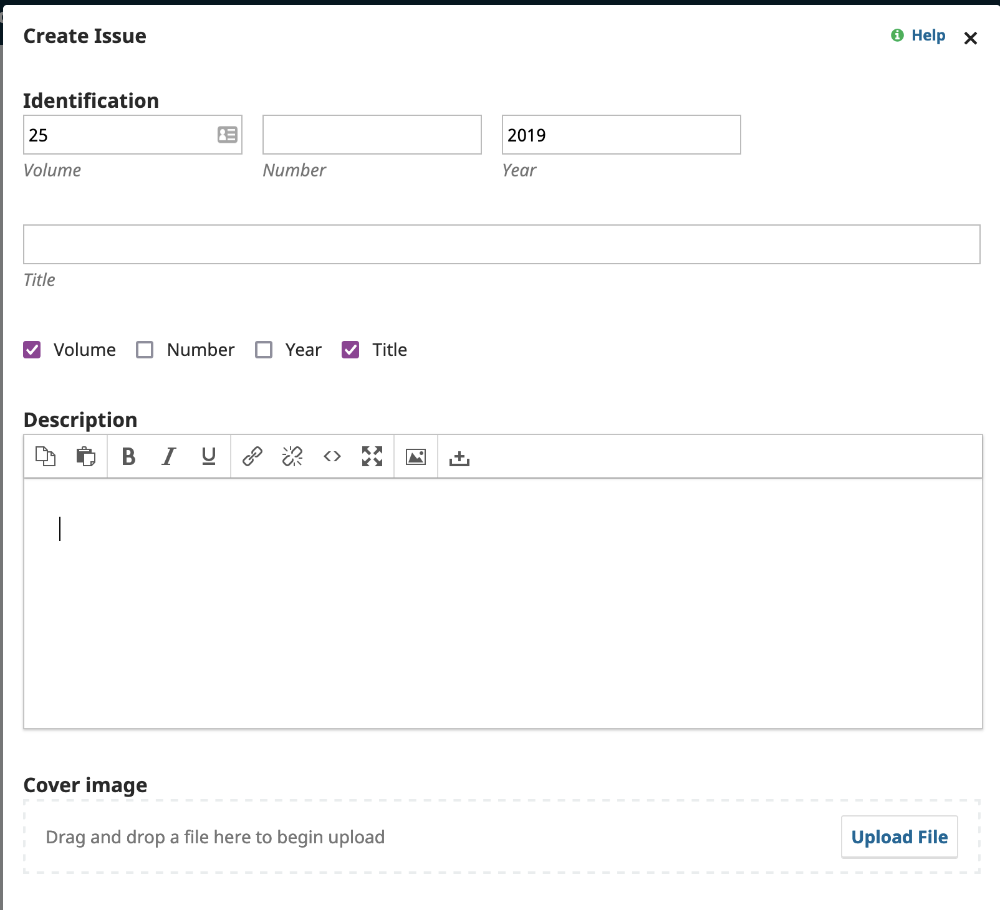

# JITP Prep

## Phase 1

Goal is to have each PDF file moved into a folder split into multiple PDFs based on individual articles and a screen capture of the screen.

### Steps
1. Pick most recent PDF. (eg. `jitp_v26_2020.pdf`)
2. Create folder that matches name minus PDF part (eg. `jitp_v26_2020`)
3. Move PDF file into new directory
3. Open PDF and use **Print to PDF** but restrict to pages of each article
4. Save article files along patter of `01.pdf` , `02.pdf` etc
5. Take a screen capture of the title page and save it as `cover_26.png` in that same folder
5. Put an `x` in the spreadsheet `progress.csv` in column **Articles Added** when issue is complete

## Phase 2

Create back issues in OJS

### Steps

1. Create Issue in OJS, by starting here: https://journals.library.brocku.ca/index.php/jitp/manageIssues#future by clicking 'Create Issue'
2. Add Volume / Year to **Create Issue** and select those two options in the check boxes
3. Add Cover image to **Cover Image**

4. Hit save to finish
5. Put an `x` in the spreadsheet `progress.csv` in column **Cover Added** when issue is complete

## Phase 3 ##

Create submissions and attach to different issues

1. Navigate to Workflows [https://journals.library.brocku.ca/index.php/jitp/management/settings/workflow](https://journals.library.brocku.ca/index.php/jitp/management/settings/workflow) and deselect **Disable Submissions**, then **Save**
1. Start at: https://journals.library.brocku.ca/index.php/jitp/submissions **New Submission**
2. **1. Start** click all checkboxes in submission requirements
3. Make sure **Submit As** is to `Journal Editor`.  Select Checkbox next to "Yes I agree..."
4. **Save and continue** 
5. **2. Upload Submission** Select PDF of next article for issue. Eg. `02.pdf`
6. What kind of file is this? Click `Article Text`. 
7. **Save and continue**
8. **3. Enter Metatdata**
9. Copy / Paste all the information into the article description: `Title` and `Abstract`
10. **Add Contributor**
11. Add `Given Name` & `Family Name` from PDF. You'll need to google to find the  `Country` for this person. The `Email` should be on the last page of the PDF.
12. **Contributor's Role** Should be Author
13. Select both checkboxes for "Principle contact" & "Include in"
14. **Save**
15. Reorder **List of Contributors** so authors are first, not your account.
16. **Save and continue**
17. **4. Confirmation** Click **Finish Submission**
18. After last submission has been completed head back to Workflow [https://journals.library.brocku.ca/index.php/jitp/management/settings/workflow](https://journals.library.brocku.ca/index.php/jitp/management/settings/workflow) enable **Disable Submissions** and **Save**.

## Phase 4 ##

Associate article with proper issue

1. Starting at: https://journals.library.brocku.ca/index.php/jitp/submissions
2. **View** Submission.
3. Ensure that all of the metadata (abstract, keywords, author details) match the PDF File, edit as necessary
3. **Accept and Skip Review**
4. Select `Do not send an email notification` and click **Next: Select Files fo Copyediting**
6. Select attached PDF. and click **Record Editorial Decision**
8. **Send to Production**
9. Select `Do not send an email notification` and click **Next: Select Files for Production**
10. Select attached PDF and click **Record Editorial Decision**
11. **Schedule for Publication**
12. On **Publication** tab navigate to **Galleys** then **Add galley** 
13. **Galley Label** is `PDF`. Click **Save**
14. **1. Upload File** Upload the same PDF file. eg. `02.pdf`
15. Click through to step **3 . Confirm** and click **Complete**
16. **Issue** add pages numbers for article in **Pages**
16. **Schedule For Publication** then choose the right issue for the article. **Save**

Once all articles for an issue are added put an `x` in the spreadsheet `progress.csv` in column **Issue staged**.

[Video of Phases 3 & 4 in action](https://brocku-my.sharepoint.com/:v:/g/personal/tribaric_brocku_ca/EW5OrrMGscBBtMuCHih3AssBJfUPq5Vh9WgX7NQgL8QMAg?e=WDBKxk)

## Phase 5 ##

Once a completed issue is staged it will need be officially published. 

1. Start at list of [issues](https://journals.library.brocku.ca/index.php/jitp/manageIssues) click drop down arrow for next issue click on **Preview** New window with staged issue is shown. Double check to make sure PDFs and page numbers are in order
2. Return to drop down menu and **Publish Issue**
3. Deselect `Send an email abou this to all registered users`
4. Hit Ok. 
5. Last step is to make the newest issue the **Current** issue. (Ie. not the archive backlog copy but the 2020 issue) Navigate to [back issues](https://journals.library.brocku.ca/index.php/jitp/manageIssues#back) page. Drop down arrow next to Vol 26 (2020). Click **Current Issue*

Once the issue has been offically published put an `x` in the spreadsheet `progress.csv` in column **Issue published**.

